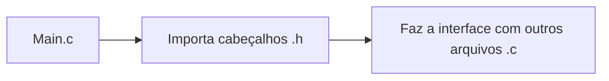
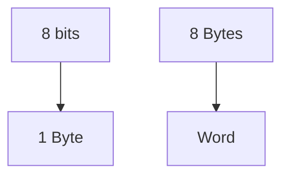

# Comando printf
Printa uma variável no terminal.
```c
printf ("Hello World \n");
```
- Tudo que está dentro dos parênteses é o argumento da função
- As aspas servem para indicar o início e o fim do conteúdo a ser exibido no terminal
- O "\n" não será printado, serve para criar uma nova linha no terminal

# Anatomia de um código em C
***Comentários***
```c
/* ISSO DAQUI É UM COMENTÁRIO */
// ISSO DAQUI TAMBÉM É UM COMENTÁRIO
```

***Main Function***
- É o ponto de partida do código.
```c
int main(void){

// COLOCA O CÓDIGO AQUI

return 0;
}
```

***Includes***
Podemos entender o programa como um "lego" no qual podemos querer inserir novas funcionalidades, daí usamos includes, que importam para o programa modulos.
```c
#include <module.h>
```
Observe que o ".h" não carrega para dentro do código o módulo, mas sim gera uma espécie de interface para ele, uma vez que tais arquivos de cabeçalho se comunicam com outros arquivos ".c", sem o "main.c" se comunicar diretamente com eles.


# Comando scanf()
```c
scanf("%tipo_da_dado", &variável);
```
Pegamos um valor digitado pelo usuário no console, que deve estar de acordo com o tipo de dado da variável especificada, e a associamos com a mesma.


# Printf() com variável
```c
printf("Mensagem printada %tipo_de_dado", variável);
```
O que teremos é que após o % iremos printar o valor na variável que é o segundo argumento da função. Repare que novamente, a variável a ser printada deve ter seu tipo especificado no primeiro argumento da função.
Também podemos alinhar as variáveis por x casas à direita, o que nos permite fazer tabelas mais organizadas, nesse caso, a sintaxe é a seguinte:
```C
printf("olha lá o numero: %Xtipo_de_dado", variável); -> substitua X pelo valor de casas 
														 a alinhar pela direita
```

# Bits, Bytes e variáveis


- Cada palavra possuí seu endereço
- Variáveis são as representações desses endereços

**Declaramos variáveis da seguinte forma:**
```c
tipo_de_dado identificador = valor;
exemplo:
int pessoas = 12;
```
Podemos transformar essa variável numa constante adicionando "const" antes do tipo de dado:
```c
const int pessoas = 12;
```
Desse modo, sempre que tentarmos mudar o tipo de dado da variável pessoas, teremos um erro.

**Regras de declaração de variáveis**
- Apenas letras (maiúsculas ou minúsculas), números e underscore (_)
- O primeiro caractere não pode ser um número

**Consistência na declaração de variáveis**
- Snake Case: my_fancy_variable
- Camel Case: myFancyVariable

Pode usar qualquer um dos dois métodos para declarar variáveis, apenas seja consistente. Além disso, escolha variáveis com identificadores autoexplicativos pra facilitar a leitura do código.

# Sistemas numéricos
**Integers**
- Sem frações
- Valores discretos
- Positivos, negativos e zero

**Sistema numérico de base 10**
- 0, 1, 2, 3, 4, 5, 6, 7, 8, 9
- Notação com base na posição dos números.
$1234 =1*10^3+2*10^2+3*10^1+4*10^0$

**Sistema numérico binário**
- 0 e 1
- Notação também posicional:
$0b1001 = 1*2^3+0*2^2+0*2^1+1*10^0=8+1=9$

**Overflow**
- Quando tentamos arquivar um número maior do que é possível devido à limitação do número de bits. EX:
	- 8 Bits
	- Menor valor: $0b00000000 = 0$
	- Maior valor: $0b00000000 = 255$
	- $255+1=0b11111111+0b00000001=0b00000000=0$ -> ==OWERFLOW==

**Números negativos**
- Temos o bit mais significativo como determinador do sinal, sendo que quando estiver em alto, teremos o número negativo, sendo o módulo do valor dado pelos bits restantes. Teremos assim, no caso de 8 bits com o sinal específicado, de -128 a 127.

**Ponto flutuante (valores fracionados)**
Ex de 32 bits
```c
1 bit    8 bits         23 bits
0        01111101       10000000000000000000000 = 0.375
sinal    expoente       fracao
```

Padrões atuais:
- Binary32
	- Sigle Precision
	- 24 significand bits
	- 7.2 decimal digits
	- 8 exponent bits
	- 38.2 decimal max exp

- Binary64
	- Double Precision
	- 53 significand bits
	- 15.9 decimal digits
	- 11 exponent bits
	- 307.9 decimal max exp

# Integers (inteiros)
**Quanto ao sinal**
``` C
int: pode ter sinal positivo ou negativo
unsigned int ou simplesmente unsigned: só pode ser positivo
```

**Quanto ao uso de memória**
``` C
short int: 2 bytes
int: 4 bytes 
long int: 8 bytes
long long int: ao menos 8 bytes
```
Pode-se utilizar longs ints com unsigned, por exemplo:
``` C
unsigned long long int
```

Apesar disso, pode-se às vezes ter problema ao se ter a necessidade exata de quatos bytes cada variável vai ocupar. Podemos importar o stdint.h, que nos adiciona mais tipos de variável.
``` C
int8_t: signed 8 bit wide
int16_t: signed 16 bit wide
int32_t: ...
int64_t: ...
uint8_t: unsigned 8 bit wide
uint16_t: unsigned 16 bit wide
uint32_t: ...
uint64_t: ...
```

***Format Specifier***
O valor que colocamos num printf para printar o valor de uma variável, no caso das inteiras são:
``` C
short int: %hd
int: %d
long int: %ld
long long int: %lld
unsigned short int: %hu
unsigned int: %u
unsigned long int: %lu
unsigned long long int: %llu
```
Se colocarmos um número entre o especificador de formato e o %, podemos definir quantos caracteres à direita queremos deixar o número. Isso é extremamente útil ao printarmos tabelas com valores, porque nos permite deixar tudo alinhadinho.

***Literals***
Podemos dizer ao compilador se estamos escrevendo em decima, binário ou hexadecimal:
``` C
uint8_t count = 255U;
uint8_t count = 0b11111111;
uint8_t count = 0xFF;
```

# Floating Points
- Podemos definir um float dessa forma:
```C
float pi = 3.14; -> Fomarto de 32bits (menor)
double pi = 3.14; -> 64bits (números muito grandes ou muito pequenos)
```
- Também podemos definir floats por notação científica:
```C
double pi = 314E-2; -> 314*10-² -> 3,14
```
- Usamos %f para printar em floating point e %e (se usar em maiúscula, o e vira E no terminal) para printar em notação científica
- Podemos definir quantas casas decimais queremos exibir ao botar um ponto seguido do número de casas desejadas:
```C
printf ("%.3f", numero); -> iremos printar somente com 3 casas decimais
```

# Char
- Utilizada para declarar uma variável que contém somente uma letra:
```C
char c = 'A'
ATENÇÃO: USAR '', E NÃO "", QUE SÃO UTILIZADAS PARA DECLARAR STRINGS, E NÃO CHARS
```
- O tamanho de uma char é de 8 bits com sinal. O valor de uma char é basicamente um número, que é associado a um caractere ASCII
- Podemos printar uma char tanto como seu valor númerico como seu correspondente na ASCII
```C
printf("%d", C); -> printa o valor numérico
printf("%c", C); -> printa a letra
```
- Podemos definir um valor numérico para uma char, que o código irá funcionar normalmente, da mesma maneira que podemos realizar operações com estes números.
- Podemos usar a função getchar() para obter diretamente uma char dada pelo usuário. Se o usuário colocar uma palavra, e não somnte um caractere, as outras letras irão para o buffer à espera de uma nova função de getchar(). Se você colocar outro getchar() logo em seguida, ele então irá interagir com a segunda letra dada pelo usuário.

# Booleanas
- Originalmente, não se tinham variáveis booleanas em C, e para realizar operações com elas, se utilizava uma inteira e se conencionava que 0=false e 1=true. Mais tarde, as booleanas foram incorporadas, mas para utilizá-las, é necessário importar a biblioteca stdbool.h:
```C
#include <stdbool.h>

int main(){
	bool a = true;
	bool b = false;
}
```
- Pode-se programar pelo método antigo, mas é uma boa prática utilizar o método mais recente, que torna o código menos confuso
- Variáveis tipos bool ainda são essencialmente tipo inteiras, tanto que utilizamos %d para printá-las, mas a biblioteca adicina um nível a mais de abstração, tanto que se printá-la, você irá ver um 0 ou 1.

# Enum
- Nada mais é do que uma lista de constantes enumeradas:
```C
enum myEnum {CONST1, CONST2, CONST3};
```
- Uma vez definida a lista, podemos criar variáveis do tipo dessa lista criada:
```C
enum cardapio{
CHA,
CAFE,
SUCO,
CERVEJA,
}

int main(){
enum cardapio mario = CAFE; -> Temos uma variável chamada mário, que nada mais será 
								do que uma inteira, mas com o seu valor associado a
								um índice da lista que criamos, sendo o primeiro 0. 
enum cardapio cleber = CERVEJA;
}

Caso não queira que o valor associado seja do índice, podemos declarar o valor associado explicitamente:
enum cardapio{
CHA = 10,
CAFE = 20,
SUCO = 30,
CERVEJA = 40,
}

Se você colocar em só um elemento, a sequência irá seguir a partir dele, ex:
enum cardapio{
CHA, -> 0
CAFE, -> 1
SUCO = 100, -> 100
CERVEJA, -> 101
}
```
- Quando printar, usa-se o %d, já que a variável que criamos é basicamente uma inteira. Nesse caso, iremos printar o número. Isso é muito útil para criar uma camada a mais de abstração no nosso código e deixá-lo mais legível.

# TypeDef
- Usando typedef, podemos nomear o tipo de variável que iremos criar, dessa forma deixando o código mais legível:
```C
typedef unsigned char byte; -> Podemos criar variáveis do tipo "byte", que na prática
							   serão unsigned char.
```
- A situação eventualmente pode ficar confusa se utilizarmos typedef num enum, mas aqui temos um exemplo de como fica:
```C
typedef enum {
CHA,
CAFE,
SUCO,
CERVEJA,
} cardapio;

Ao declarar uma nova variável associada ao enum, podemos deixar a coisa bem mais simples:
ANTERIORMENTE: enum cardapio mario = SUCO;
		AGORA: cardapio mario = SUCO;
```
# Format Specifiers

|Type|Specifier|
|----|---------|
|char|%c|
|int|%i, %d|
|unsigned int|%u, %x, %o|
|long int|%ld|
|unsigned long int|%lu, %lx, %lo|
|long long int|%lld|
|float|%f, %e, %g, %a|
|long double|%Lf, %Le, %Lg, %La|
|id|%@|


# Operadores Aritméticos

|Operador|Descrição|
|-----------|----------|
|+|Soma dois operandos|
|-|Subtrai dois operandos|
|asterisco|multiplica|
|/|divide|
|%|resto da divisão (somente em inteiros)|
# Operadores de incrementação

|Operador|Descrição|
|--------|--------|
|++|Incrementa o valor em 1|
|--|Decrementa o valor em 1|
Observe que a posição do operador em relação ao operando faz diferença. Se ele vem depois do operando, a expressão irá considerar o valor, e depois realizar a operação, se vier antes, a expressão irá considerar o valor incrementado ou decrementado;
ex:
```C
b=5;
c=5;
a = 2*b++; -> a será igual a 10, e sem seguida, b=6;
a = 2*++c; -> a será igual a 12

```

# Operadores de comparação
|Operador|Descrição|
|-----|------|
|dois iguais seguido|igual a|
|!=|diferente de|
|>|maior que|
|<|menor que|
|>=|maior ou igual a|
|<=|menor ou igual a|

# Operadores lógicos
|Operador|Descrição booleana|
|---|---|
|&&|AND|
|duas barras retas seguidas|OR|
|!|NOT|
Diferentemente dos operador bitwise, esse irá considerar a palavra binária inteira durante sua operação, e não em bit por bit.
# Operadores bitwise
Operam diretamente bit a bit, sendo muito rápidos e úteis em códigos de baixo nível de abstração
|Operador|descrição|
|-|-|
|&|bitwise AND|
|barra reta|bitwise OR|
|^|bitwise XOR|
|~|bitwise NOT|
|<<|desloca bit para a esquerda|
|>>|desloca bit para a direita|
Operadores de deslocamento pode ser utilizados para multiplicar ou dividir números.
A<<N = Avezes2^N ou então A>>N = A/2^N. Em sistemas embarcados, isso nos permite ser extremamente econômicos em recursos computacionais.

# Bitmasks
Imagine a tabela verdade de uma AND:
|X|Y|RESULTADO|
|-|-|-|
|0|0|0|
|1|0|0|
|0|1|0|
|0|1|1|
Imagine o valor Y como uma "máscara", uma operação que realizamos sobre o valor X. Observe que sempre que essa máscara for 0, a saída também será 0. Temos aqui uma máscara chamada de
"BIT CLEARING", pois irá sempre zerar o valor do bit.
Realizar operações com esse "truque" de máscaras sobre os bits é especialmente útil ao programas em baixo nível, já que podemos manipular um bit específico de um microcontrolador.
Outras máscaras que seguem a mesma lógica são:
|Operador bitwise|Bitmask|Descrição|
|-|-|-|
|&|Bit Clearing|Máscara = 0 -> resultado é 0|
|&|Bit Testing|Máscara = 1 -> resultado é a input|
|barra reta|Bit Setting|Máscara = 1 -> resultado é 1|
|^|Bit Toggling|Máscara = 1 -> entrada é invertida|

# Bit Manipulation
Como manipular os bits, vistas as bitmasks, exemplos:
- Setting Nth position:
	- Syntax: result = data | 0b01000000;
	- Entretanto, o último método não é prático para palavras binárias muito longas, então utilizamos o operador de shift (deslocamento)
	- Syntax: result = data | (1<<6);
	- Ao colocarmos (1<<6), temos basicamente uma palavra binária com todos os outros bits, exceto o 6, como zero. Lembre, o bit 0 também conta, então temos o bit 6, mas seria a 7 posição da palavra
- Clear:
	- Syntax: result = data & ~(1<<n);
	- n é qual o bit que queremos limpar
	- Se fosse somente o (1<<n), teríamos uma array inteira igual a 0 e o 1 no local especificado, mas ao adicionarmos o operador bitwise de NOT ~, invertemos, ficando com 0b110111111 (por exemplo).

# Assignments Operators
Usada para dar um valor a uma variável, ex:
variavel = valor;
**Compound form: Quando temos a mesma variável nos dois lados da igualdade:**
|Operador|Igual a|Exemplo|
|---|---|---|
|+=|a = a+b| a += b|
|-=| a = a-b | a -= b|
|asterisco=|a = aasteriscob| a asterisco=b|
|/=|a = a/b | a /= b|
|%=| a = a % b| a %= b|
**A mesma lógica se aplica a operadores bitwise, mas não vejo necessidade de ficar fazendo milhares de tabelas**

# Função sizeof e tipo size_t
Retorna o tamanho de algo em uma int
```C
size_t size = sizeof(something);
```
Temos uma variável tipo  size_t, chamada size, que irá medir o tamanho de algo.
O tipo size_t sempre terá o maior tamanho de variável que o dispositivo programado permitir.
Esta função é muito útil, pois melhora a portabilidade do código entre diferentes arquiteturas e dispositivos;

# Casting and Implicit Conversions

Casting consiste em converter um tipo para outro, fazemos isso colocando o tipo para qual queremos converter entre parênteses antes do valor a ser convrtido:
```C
int valor = (int) valor_float;
```
Estamos alterando uma float para uma int, e então atribuindo o valor convertido a variável valor.
Este tipo de conversão pode resultar perda de informações devido ao tamanho das variáveis em decorrência de truncamentos.
Também temos conversões implicitas, quando o compilador faz uma conversão de tipo por conta própria.
Um tipo muito comum é a Integer Promotion, quando duas variáveis são transformadas em ints para serem processadas, imagine o código:
```C
CÓDIGO
#include <stdio.h>

int main (){
char a = 0xFF; //-1
unsigned char b = 0xFF; //255
printf ("a==b --> %d", a==b);
return 0;
}

OUTPUT
a==b --> 0
```
Mesmo que numericamente ambos sejam iguais (0xFF), ao serem processadas elas são convertidas pra ints. Mesmo que seu valor seja numericamente igual em chars, em ints, são diferentes, e portanto, o programa irá retornar 0.
Sempre que o programa receber uma conversão implicita, ele fará as conversões seguindo a hierarquia:

int promotion -> int -> unsigned int -> long int -> unsigned long int -> long long int -> unsigned long long int -> float -> double -> long double.

Se mesmo após a int promotion os tamanhos ainda não baterem, o valor será convertido para o maior valor do seu tipo, seguindo a hierarquia anterior. Vale falar que só podemos converter implicitamente se seguirmos ela, se quisermos "voltar", devemos declarar claramente com uma operação de casting.

# Ternary Operator

Podemos entender como uma forma mais curta de escrever um if else:
```C
condicao ? valor_se_verdadeiro : valor_se_falso

EXEMPLO:

int a = 10, b = 20, c;

c = (a<b) ? a:b;
//Neste caso, c irá obter o valor de 10, de a, porque a é menor que b.
```

# Observações sobre control flow 

Como este é um tema que domino relativamente bem, não irei anotar tudo, mas somente coisas novas que fazem sentido.

- O "if" será verdadeiro se for diferente de zero. Por isso, podemos colocar uma viariável sozinha nas condições. Se for diferente de zero, o comando irá acontecer.

- Em switch cases sempre temos que colocar o break, além disso, podemos utilizar um valor default no final das constantes.

- A diferença entre o While e o Do/While é que no while primeiro verificamos a condição, e então realizamos a operação. No do/while, primeiro realizamos a operação, e então verificamos a condição
```C
SINTAXES
while (teste)
{

}

do
{

}
while (teste)
```

- O "break" quebra imediatamente o loop no qual está inserido;
- O "continue" pula diretamente ao final do loop, na prática, ignorando os comandos e indo novamente para o teste da condição.

- Apesar de não ser recomendável utilizar gotos, ele pode ser útil para quebrar nested loops, já que um break iria sair de somente um dos loops.
- O motivo pelo qual devemos evitar o uso do goto, é porque ele acaba deixando o código pouco legível.

# Funções, variáveis globais e locais

```C
return_type function_name (tipo1 parametro1, tipo2 parametro2,...)
{
//Corpo da função

return expression;
}
```

- Podemos declarar a função sem escrever nada dentro, colocando somente um ";" depois de fechar o parênteses. Teremos de declarar a função novamente e adicionar algum código a ela mais tarde, mas isso é útil para escrever cabeçalhos e deixar o código mais legível.

- Tente utilizar mais variáveis locais, porque assim, se obtivermos algum problema com aquela variável, sabemos exatamente onde está o problema.

- Se uma variável global e uma local com o mesmo nome, dentro do escopo da variável local, ela que irá valer.

# Debugging

- Dicas para um debugging facilitado
	- Use nomes que façam sentido
	- Planejamento e documentação organizados e claros
	- Quebre os problemas em problemas menoras
	- Keep it simple
	- Dê um passo de cada vez, sempre testando a cada passo
	- Unit testing: test driven development
	- Use printf com sabedoria
	- Crie log files

- Quando utilizamos break points no visual studio code, temos na aba de debug as variáveis, o "watch", onde podemos adicionar expressões para observarmos e o call stack, onde observamos qual função está sendo chamada.
- Se clicarmos com o botão direito num breakpoint, podemos colocar uma expressão que irá funcionar como condição para o breakpoint, e o código só irá parar se a condição for verdadeira.

# Type Casting

Como o C é uma linguagem extremamente tipada, não prestarmos atenção ao tipo e não realizarmos as conversões quando necessário pode ser muito danoso ao código.
Podemos castar um tipo para outro por meio de:
```C
(tipo) expressão

POR EXEMPLO:

int total = 17, values = 5;
double average;

average = (double) total/values;

Temos que especificar aquele double porque como a operação é realizada entre duas ints, irá retornar um valor inteiro. Ao castar para um double, teremos a operação realizada com doubles, e não teremos perda de informação.

PODEMOS FAZER A CONVERSÃO UTILIZANDO PONTEIROS:

(tipo *) expressão
```

# Ponteiros

- Se referem ao dado por meio do endereço, uma vez que o seu valor será o mesmo que está no valor ao qual está "apontando".

```C
int *info;

criamos um ponteiro chamado info que irá apontar para uma informação do tipo int.
```

- Podemos igualar um ponteiro a NULL 
```C
int *info = NULL;
```
Neste caso, é garantido que ele não irá apontar a nenhum endereço. Entretanto, se tentarmos utilizá-lo enquanto ainda é NULL, teremos um "Segmentation fault", que ocorre quando o programa não consegue acessar um local de memória, o que pode crashar o programa. Podemos resolver este tipo de problema com um if, por exemplo: if (ptr != NULL){//dá um endereço válido}.

Apontamos para algum endereço com:
```C
int *info = &data;

caso queiramos converter o dado para int

int *info = (int *) &data;

ex:
uint32_t *info = (uint33_t *) 0x100C;
```

- Podemos definir um ponteiro do tipo "void", que pode apontar para qualquer tipo de dado.

- Exemplo de código:
```C
int apples = 12;
int *ptr = &apples;

//Pegando o valor de apples indiretamente
int num_1 = *ptr; //num_1 = 12

//Setando o valor de apples indiretamente
*prt = 99; //apples = 99
```

- ===Existe diferença entre o que o ponteiro aponta e o que é o seu valor:===
```C
printf (%c, *ptr); ->Aqui, iremos printar o que está no endereço aonde o ponteiro aponta

printf (%llu, ptr); ->Aqui, iremos printar o valor do ponteiro, que será o número correspondente ao endereço para o qual aponta

Quando temos o asterisco, temos um valor armazenado no endereço ao qual aponta, quando não o temos, temos o endereço em si.
Por exemplo:
ptr = &infos; -> Setamos o endereço de ptr como infos
*ptr = 34; -> Alteramos o valor do endereço de infos para 34
```

- O C é uma linguagem extremamente tipada, isso significa que tentar atribuir uma variável a um ponteiro de tipo diferente pode dar besteirinha.

- Definindo ponteiros constantes:
```C
int *const ptr = &data -> O endereço é constante, nunca poderá mudar

const int *ptr = &data -> Nunca conseguiremos mudar o valor de data pelo ponteiro

const int *const prt = &data -> Nunuca conseguiremos mudar o endereço nem o valor de data
```

Se ainda estiver confuso: https://youtu.be/2ybLD6_2gKM

# Ponteiros e Funções

Observe o código:
```C
void printStudents (int studentes)
{
	printf ("Students = %d\n", students);
}

int main()
{
	int girls = 12, boys = 9, students;
	students = girls + boys
	
	printStudents (students);
}
```
Observe que temos duas variáveis locais chamadas "students", entretanto, como estão em funções diferentes, alterar o valor de students dentro de printStudents não altera o valor de students na main.

A variável students de printStudents é copiada do valor de students da main quando chamamos a função printStudents. 

Dessa forma, ao modificarmos o valor de students de printStudents, estamos na verdade modificando uma cópia do valor de students da mains. Entretanto, o que fazemos caso queiramos modificar o valor de students da main utilizando a função?

Neste caso, utilizamos ponteiros como argumentos. Dessa forma, o que estaremos copiando será o ENDEREÇO que iremos modificar. Assim, podemos modificar o valor armazenado naquele endereço de dentro da função, processando o dado em si, e não somente uma cópia dele.

Veja o exemplo deste exercício que fiz durante o curso:
```C
#include <stdio.h>
#include <stdlib.h>

/*
Criar um programa que inverte duas ints. A inversão deve ser realizada dentro de uma função, mas as ints devem ser declaradas na main.
*/

int swap (int *a, int *b)
{
    int aux = *a;
    *a = *b;
    *b = aux;
}

int main()

{
    int a = 3, b = 2;
    printf ("Antigo valor de a: %d | Antigo valor de b: %d", a, b);
    swap(&a, &b);
    printf ("\nNovo valor de a: %d | Novo valor de b: %d", a, b);
}
```
Veja que estamos alterando diretamente o valor das variáveis por estarmos utilizando ponteiros.
- O programa funciona, mas alguns fatores a se levar em consideração:
	- A função swap, como não retorna nenhum valor, pode ser uma void, e não necessariamente uma int;
	- Como os endereços não mudam, podemos definir os endereços dos ponteiros como constantes nos parâmetros da função.
- Se estiver confuso: https://youtu.be/qz_iz_PLorc

# Arrays

An ordered collection of items of the same type.

Poderíamos utilizar um monte de variáveis do mesmo tipo no lugar de uma array, poeque funcionaria, mas isto é estúpido porque não é escalável, isto é, se quisermos realizar comparações com todos os valores, teremos que realizar uma a uma, ao invés de simplesmente utilizar um laço de repetição, por exemplo.

Então, podemos fazer de um jeito mais inteligente...
Declarando e acessando uma array:
```C
//Exemplo de array do tipo float sendo declarada:
tipo array[numero_de_itens];
//ex:
float array_massa[5];

//acessando um indice da array
//colocando um valor:
array_massa[3]=1.45; //agora o valor do indice 3 de array massa é 1.45
//lendo um valor
float numero;
numero = array_massa[3]; //agora o valor de numero será de 1.45
```

Observe que logo que declaramos uma array, uma vez que ela não foi inicializada, ela contém valores totalmente imprevisíveis. Caso queiramos deixar todos com valores previsíveis, podemos criar um loop que irá atribuir um valor par acada indíce, ou declarar os valores dos índices diretamente, ex:
```C
int x[]={1,2,3,4,5,6}; //valores previsíveis :)
```
Observe que como estamos declarando diretamente os seus elementos, não precisamos declarar a quantidade de elementos que ela terá.
Mas tem um ponto **IMPORTANTE** s er levado em consideração, que é o fato do tamanho de uma array precisar ser uma contante em tempo de compilação, ou seja, não pode ser uma variável definida durante a execução do programa se a array for declarada.
Ex:
```C
//Jeito que não vai funcionar
int n = 10;
int vetor[n];

//Alternativa que funciona é usar macros e defines:
#define TAMANHO 10
int vetor[TAMANHO];
```
Porém, podemos criar uma array com função variável se tivermos a declaração em runtime no lugar do compile time. Como por exemplo, caso pedissemos para o usuário inserir o valor de uma array por um scanf(), atribuir este valor a uma variável, e esta variável ao tamanho da array. Observe que isto só é permitido a partir da versão C99.

Podemos ainda definir o valor de índices específicos no momento da declaração:
```C
int w[5] = {[1]=1, [3]=9}//iniciando a array w com os índices 1 e 3 já definidos, todos os outros, serão 0.
```

# Descobrindo o tamanho de uma array
Se utilizarmos sizeof() numa array, teremos o tamanho em bytes do total da array. Caso queiramos descobrir o tamanho em índices, basta dividir o tamanho total da array pelo tamano em bytes de cada elemento, ex:
```C
int x[]={1,2,3,4,5}; //declarando uma array
int s = sizeof(x); //pegando o tamanho total da array
int e = sizeof(x[0]);//pegando o tamanho de um elemento da array
printf("\n%d",(s/e));//printando quantos índices tem a array
```

Uma coisa interessante é que o nome da array é basicamente uma label para o seu endereço. Isto significa que, no código anterior, caso printássemos x ou &x[0], teríamos a mesma coisa.

# Pointers Arithmetic

Podemos utilizar uma array como argumento de uma função
```C
int func(int arr[]){}
```
Observe porém, que o tamanho da array não foi especificado, e portanto, utilizar o sizeof() não irá funcionar. 
Utilizar uma array e um ponteiro é a mesma coisa aqui, então podemos tranquilamente substituir o arr[] por um ponteiro e utilizar do mesmo jeito, que vai funcionar igual.
```C
int func(int *p){}
```

Agora falando sobre operações com ponteiros de fato, observe que quando utilizarmos ++ num ponteiro, estaremos movimentando-o um endereço de memória a frente, ex:
```C
int *ptr = x; //supondo que x seja uma int no endereço 6422000
ptr++; //agora o ponteiro está apontando para 6422004.
```
Veja que o endereço aumentou em 4 bytes porque estamos utilizando um ponteiro do tipo int, se fosse outro tipo, a mudança seria de acordo com o tamanho do tipo.
Isso é útil para trabalhar com arrays, já que nelas, seus elementos sempre ocorrem em endereços consecutivos e ordenados de acordo com o índice. Sendo assim, podemos substituir o endereçamento de uma array por um ponteiro. 

Observe que não conseguimos realizar operações de soma, divisão, multiplicação e resto entre ponteiros.

# Multidimensional arrays

Até agora, só trabalhamos com vetores (arrays multidimensionais), mas também podemos fazer arrays com diversas dimensões (matrizes).
Por exemplo:
```C
int matrix[LINHAS][COLUNAS];
```
Declaramos uma matriz...
```C
int tensor[CAMADAS][LINHAS][COLUNAS];
```
Este tipo de array com 3 ou mais dimensões é normalmente chamado de "Tensor"
Observe que se quiséssemos, poderíamos fazer arrays com infintas camadas.

Inicializando e printando as arrays:
```C
int matrix[3][5]={
	{11,12,13,14,15},
	{21,22,23,24,25},
	{31,32,33,34,35},
};

int tensor[2][2][4]={ //Confuso, eu sei, mas veja, temos 2 layers, cada uma com 2 linhas, cada uma com 4 colunas.
	{
		{111,112,113,114},
		{121,122,123,124}
	},
	{
		{211,212,213,214},
		{221,222,223,224}
	}
};

//vamos printar essas arrays, observe que iremos precisar de loops em cascata:
//printando a matriz
for(int i = 0; i<3; i++){
	for (int j = 0; j<5; j++){
		printf("%d ", matrix[i][j]);
	}
	printf("\n");//adicionamos isso pra não printar tudo numa linha só
}
printf("\n\n");
//printando o tensor
for (int l = 0; l<2; l++){
	for (int i=0; i<2;i++){
		for (int j=0;j<4;j++){
			printf("%d ",tensor[l][i][j]);
		}
		printf("\n");
	}
	printf("\n");
}
```

# String

An order of collections, basically an array of chars

A the end of the string, we got \\0(null), to indicate that the string is over.

declaring a string:
```C
char string[10]; //observe que um dos espaços será reservado para o null character, então teremos, na prática, 9 letras.

char str[]={'h','e','l','l','o','\0'};

char str[]="Hello!";
```

Mudar uma letra é como mudar um valor num array, utilize o índice. Observe que não temos como mudar uma string inteira de uma só vez, se formos fazer isto, devemos fazer um laço de repetição que substitui letra por letra.

Printando:
```C
char str[]="Salve";
printf("%s\n",str); //printa a string
printf("%szn",&str[3])//printa somente a partir do índice 3
printf("%.3s",str)//vai prontar somente até o índice 3
```

Podemos fazer ainda uma array de strings, que nada mais é que uma matriz:
```C
char days[][10]={
"Monday",
"Tuesday",
"Wednesday",
"Thursday",
"Friday",
"Saturday",
"Sunday",
};
```

Podemos utilizar o scanf para pegar input do usuário, entretanto, ele irá pegar somente uma palavra.

# Comprimento de uma string

Uma forma de calcular o comprimento de uma string é utilizar um loop que rode até encontrarmos o null operator. Outra forma, é utilizar o sizeof, que irá retornar quantos bytes em a string. Se levarmos em conta que cada byte é um caractere, saberemos então o tamanho da string +1 (porque ele considera o null operator).
Podemos ainda, utilizar a função strlen(), mas para isso, precisamos incluir o string.h

# Copiando strings

Podemos utilizar o strcpy(), que copia uma string e atribui a outra. Porém, esta função não checa o tamanho das arrays, fazendo com que a string copiada seja escrita fora da string onde iremos copiar, o que pode crashar o programa. 
Podemos então utilizar a strncpy()m que faz esta checagem.
Não esqueça do string.h

# Comparando strings

strcmp(st1, str2), vai ficar comparando as duas strings até encontrar alguma diferença ou uma string acabar, retornando <0 se a primeira string for menor que a segundo, >0 se a segunda for menor que a primeira, ou 0 se forem iguais;

já a strncmp(str1, str2, n) fará  mesmo, mas somente até um índice específico determinado por n.

# String Searching and Tokenization

- strchr(): locate first occurrance of a character in a string
- strstr(): locate substring
- strtok(): split string into tokens

# Analyzing Strings

include ctype.h

vendo o tipo:
```C
//return_func func (parameter);
int islower(int c);
int isupper(int c);
int isalpha(int c); //checa se é alfabético
int isalnum(int c); //checa se é alfanumerico
int isdigit(int c); //checa se é um digito decimal
int isxfigit(int c); //checa se é um digito hexadecimal
int iscntrl(int c); //checa se é um caráctere de controlew
int isprint(int c); //checa se é um caractere printável
int isspace(int c);
int ispunct(int c);
```

convertendo entre upper e lower:
```C
int tolower(int c);
int toupper(int c);
```

convertendo strings para numeros (stdlib.h):
```C
int atoi (const char *str); //string to int
long int atol (const char *str);
double int atof(const char *str);
double strtod(const char *str, char **endptr);
long int strtol(const char *str, char **endptr, int base);
```
Observe que somente as duas últimas irão retornar uma mensagem derro caso a conversão não dê certo.

ex de código:
```C
#include <stdio.h>
#inclide <stdlib.h>
#inclide <stdbool.h>

int main()
{
char str[]="123456";
char *pend;

long num = strtol(str, &pend, 10); //convertendo o str, com o ponteiro pend, em base 10, para a variável num (que será uma long int)

printf("Conversion: %ld\n",num);//printando a long int convertida
}
```

# Dynamic Memory Allocation

Em linguagens de alta abstração, não se tem controle sobre a memória, mas não em C.
A memória dos programas em C é dividida em 3 partes:
- Static: variáveis globais ou estáticas, permanece durante toda a duração do programa.

- Stack: variáveis locais e argumentos de funções, automaticamente gerenciada pelo compilador. Todas as variáveis que permanece aqui tem seu tempo de vida limitado pelo tempo de vida da função que a inicializou. O que pode acontecer aqui é o chamado stack overflow (o evento que dá o nome do lugar onde a gente faz pergunta estúpida pra programador sênior), onde o stack fica sem espaço pra alocar mais variáveis, o que é um problemão.

- Heap: Um tantão de memória que pode ser utilizado dinamicamente, sendo controlada pelo programador. Tome cuidado com memory leaks, onde alocamos dados no heap durante uma função, mas esquecemos de dealocar, e todas as vezes que chamamos uma função estamos inundando (*ba dum tss*) a RAM.

Podemos fazer a alocação com:
```C
void *malloc(size_t size) //aloca memória
void *calloc(size_t nume, size_t size) //aloca array de elementos
void *realloc(void *ptr, size_t new_size) //realoca a memória
void free(void *ptr) //libera a memória
```

Malloc vai alocar "size" bytes de memória não utilizada. Se alocar com sucesso, vai retornar um ponteiro apontando pro começa da memória alocada, se der ruim, retorna um null pointer. Ex:
```C
#include <stdio.h>
#include <stdlib.h>
int main(){
    int *p1 = malloc (4*sizeof(int)); //aloca um espaço pra uma array de 4 ints  

    for (int i=0; i<4; i++){ //populando a array
        p1[i] = i*i;
    }

    for (int i=0; i<4; i++){ //printando esta array
        printf("p1[%d] = %d\n", i, p1[i]);
    }

    free(p1); //liberando a memória alocada pra evitar memory leak
}
```

Tome muito cuidado com a função free, porque se passar um espaço da memória que já foi dalocado, o seu comportamente é indefinido. Normalmente, o programa vai crashar.

Calloc, exemplo:
```C
#include <stdio.h>
#include <stdlib.h>
int main(){
    int *p1 = calloc (4, sizeof(int)); //aloca um espaço pra uma array de 4 ints

    for (int i=0; i<4; i++){ //printando esta array
        printf("p1[%d] = %d\n", i, p1[i]);
    }

    free(p1); //liberando a memória alocada pra evitar memory leak
 
    return EXIT_SUCCESS;
}
```
Observe que como não estamos populando a array, e por padrão a função irá colocar 0 em todo, iremos printar 0.

Isso é útil pq nem sempre sabemos o tamanho de uma matriz com precisão, e alocação dinâmica nos permite a ir criando "on the run". Além disso, é útil quando queremos que uma variável de uma determinado escopo não seja deletada quando aquele escopo é encerrado.

# Structures

Ao invés de simplesmente sairmos declarando um monte de variáveis soltas, podemos declará-las dentro de uma struct, estruturando melhor o código, ex:
```C
//Definindo a struct
struct Cartesian_dot{
	char *name;
	int dimensions;
	double position[MAX_DIMENSIONS];
	bool active;
};

//Declarando elementos a partir desta struct:
struct Cartesian_dot dot1;
dot1.name = "particle1";
dot1.active = true;
dot1.dimensions = 2
dot1.position[0]=2; 
dot1.position[1]=5;
```
Desta forma, podemos criar quantos pontos quisermos sem termos que criar um monte de variáveis, isto deixa o código mais escalável e legível. Veja que podemos ainda colocar a struct dentro de um typedef, e então não seria necessário, ao declarar um novo ponto, colocar "struct" na frente, o que deixa o código mais legível.
Podemos ainda fazer nested structs, com structs dentro de structs, por exemplo, podemos ter uma struct chamada "Plane", e dentro desta struct, colocar a struct "Cartesian_Dot", criando assim diferentes planos com diferentes pontos.

Mas este jeito de iniciar structs é meio ruim, podemos fazer de outras maneiras (tendo a struct dentro de um typedef chamado Dot):
```C
Dot dot1={
	"particle1",
	true,
	2,
	{2,5},
}
```
Observe que desta forma, os elementos devem ser declarados na mesma ordem que na struct/typedef

Outra forma (veja que esta é bem mais legível):
```C
Dot dot1={
	.name="particle1",
	.active=true,
	.dimensions=2,
	.position={2,5},
}
```

Além disso, possuímos também os chamados bit fields, que nos permite escolher dentro da struct o tamanho de um determinado tipo. Isto é muito útil em sistemas embarcados, porque nos permite fazer um código econômico em memória:
```C
#include <stdio.h>
#include <stdlib.h>
#include <stdint.h>
typedef struct LedStatus{ //struct normal, odne cada elemento tem 8 bits, dando um total de 3 bytes (veja tbm que estamos utilizando um bem bolado entre typedef e struct)
    uint8_t led1;
    uint8_t led2;
    uint8_t led3;
} LedStatus;  

typedef struct LedStatusBitField //struct com bit field, onde cada elemento terá somente 1 bit, dando um total de 1 byte (na verdade menos, mas o interpretador utiliza 1 byte inteiro)
{
    uint8_t led1 : 1;
    uint8_t led2 : 1;
    uint8_t led3 : 1;
} LedStatusBitField;

int main()
{
    printf("%lld\n",sizeof(LedStatus)); //irá printar 3
    printf("%lld\n",sizeof(LedStatusBitField)); //irá printar 1
    return EXIT_SUCCESS;
}
```

Também podemos criar arrays de elementos de struct, bem como ponteiros, mas com ponteiros a coisa fica um pouco diferente, pq temos o ponteiro apontando para a struct em si, e para os elementos, podemos utilizar o "arrow operator" (->), exemplo de código:
```C
#include <stdio.h>
#include <stdlib.h>

//criando uma struct
struct coordenadas{
    int x,y;
};
int main()
{  
    //criando as coordenadas do ponto1
    struct coordenadas ponto1;
    //declarando o ponteiro da struct coordeanas
    struct coordenadas *pt;
    //determinando o endereço para o qual o ponteiro da struct irá apontar
    pt = &ponto1; 

    //populando a struct
    pt -> x=5; //com arrow operator
    (*pt).y=10; //sem arrow operator

    //printnando so valores
    printf("%d\n",pt->x); //com arrow operator
    printf("%d\n",(*pt).y); //sem arrow operator
  
    return EXIT_SUCCESS;
}
```

Uma coisa que podemos fazer é criar uma função e e declarar a struct dentro dela, então na main igualarmos ela a uma struct. Observe que aí teremos duas structs, se trabalharmos com structs muito grandes, isto pode ocupar muita memória, então podemos declarar a struct como ponteiro, alocar ela dinamicamente, e retornar este ponteiro, poupando memória.

Quando for colocar uma string dentro uma struct, utilize ponteiros para declarar aquela variável. Além de ocupar menos memória e ser mais rápido, é mais fácil de realocar um valor ali. Basta fazer:
```C
nome_da_struct.nome_do_parametro = "Nova string";
```
Se não declarar esta variável como ponteiro dentro da struct, a unica maneira de alterar seu valor será utilizando strncpy().

Apenas podemos criar uma array dinâmica dentro de uma struct quando ela for o último elemento da struct.

# Unions

Um tipo bizonho de dado que nos permite salvar dois tipos diferentes de dados num mesmo lugar da memória.

Isso pode ser útil, por exemplo, podemos construir uma mensagem bit a bir numa struct. Quando formos enviar a mensagem, não queremos enviar bit a bit, mas sim o byte inteiro, então utilizamos unions, ex:
```C
typedef struct{
	uint8_t enable : 1;
	uint8_t readey: 1;
	uint8_t mode : 2;
	uint8_t info: 2;
} RegBits;

typedef union{
	RegBits bits;
	uint8_t byte;
} RegisterInfo
```
Desta forma, podemos nos referir ao byte, e teremos a mensagem inteira, sem termos que ir bit a bit da struct.

É para isto que servem unions, podemos tanto manipular e ler um registrador bit a bit, quanto manipulá-lo ou acessá-lo como um todo.

# Macros

Um preprocessor não é compilada, na realidade ele simplesmente faz uma substituição de texto. Ele pré-processa o código antes dele ser compilado, como o include e o define.

Alguns preprocessors (==Não esqueça do "#" na frente"==):
- define: macro de substituição
- include: importa cabeçalhos de outros arquivos
- undef: undefine o macro de substituição
- ifdef: retorna true se o macro foi definido
- ifndef: retorna true se o macro não foi definido
- if: testa se uma condição de tempo de compilação é true
- else: alternativa ao if
- elif: tu já entendeu, né?
- endif: encerra a condicionar do preprocessor
- error: printa mensagem de erro no stderr
- pragma: manda comandos especiais pro compilador

Assim, podemos fazer uma espécie de compilação condicional, o que é bem massa.

Também temos alguns macros predefinidos:
- ______DATE______ : Retorna a data
- ______TIME______ : Retorna a hora
- ______FILE______ : O nome do arquivo
- ______LINE______ : A linha do código
- ______STDC______ : Equivale a 1 se o código for compilado com o padrão ANSI

Uma parada muito legal que dá pra fazer são macros que parece funções. Um exemplo, é que não dá pra criar uma função que calcula o tamanho de uma array, pq precisamos descrever seu tipo e tamanho nos argumentos, o que já inutiliza completamente a sua usabilidade. Mas, podemos utilizar macros:
Sintaxe:
```C
#define MACRO(argumento) (operação)
```
Calculando o tamanho da array:
```C
#define CAL_ARRAY_LEN(x) (sizeof(x)/sizeof(x[0]))
```
Assim, quando quisermos saber o tamanho de uma array, não precisamos toda vez escrever "sizeof(x)/sizeof(x[0])", pq o macro já irá fazer isto para nós. Lembre-se, o macro é literalmente só uma substituição de texto, mas de qualquer forma, ainda torna o código muito mais legível.

Exemplo de macro que pega um maior entre dois números:
```C
#define MAX(a,b) (a > b ? a : b)
```
Observe porém, que usar macros tem alguns pontos negativos. Estamos fazendo uma substituição de texto, o que pode ser meio problemático às vezes, exemplo (considere o macro MAX já definido):
```C
int a = 1, b = 5;
printf("%d",MAX(a,b++));
```
Queremos saber qual o maior número, se é a(1) ou b++(6), mas quando rodarmos o programa, teremos 7....
Como? Simples, o macro irá  extender para:
```C
a > b++ ? a : b++;
```
Observer que temos duas vezes o incremento em b. Portanto, quando formos utilizar macros como funções, temos que tomar muito cuidado se formos utilizar operadores em suas inputs.

Agora, indo para compilação condicional:
```C
#define LOG_INFO

#ifdef SOME_MACRO
	printf("SOME_MACRO existe \n");
#endif

#ifdef LOG_INFO
	printf("LOG_INFO");
#else
	printf("Sem LOG");
#endif
```
Veja que só irá ser compilado, e portanto só irá ser printado, LOG_INFO, pq é o único macro que temos.

Mas o ifdef só funciona para verificar se um macro foi ou não definido. Podemos fazer mais umas baguncinhas:
```C
#define BUFFER_SIZE 1024

#if BUFFER_SIZE > 2048
	printf("MAS QUE BUFFERZAÇO");
#else
	printf("Mas que bufferzinho mixuruca");
#endif
```
Veja que a depender do tamanho do buffer, iremos compilar uma coisa ou outra.
Isso é muito útil para fazer programas mais leves e econômicos, porque não tem necessidade do programa ser capaz de lidar com um buffer de tamanho x e y se ele sempre será de tamanho x, então fazemos esta compilação condicional e ganhamos mais espaço.

# File I/O

Temos muitas funções massas pra explorar arquivos em memória permanente na biblioteca stdio.h para abrir, ler, modificar e fechar arquivos. Suas funções (e mais uns macros e tipos de variável, além de funções como printf e scanf) podem ser encontrados aqui: https://www.tutorialspoint.com/c_standard_library/stdio_h.htm e mais completo (mas mais complicado tbm) aqui: https://en.cppreference.com/w/c/io

Podemos utilizar para abrir um arquivo o fopen(), para fechar fclose().
Podemos ler um arquivo com fgetc(), getc() ou ainda fread().
Podemos escrever num arquivo com fwrite().
Podemos "navegar" dentro do arquivo com ftell(), fgetpos(), fseek(),fsetpos(),rewind().

Aplicando isto tudo num programão de exemplo que copiei da aula excessivamente comentado pra ter certeza que vou entender tudo:
```C
#include <stdio.h>
#include <stdlib.h>

#define SAMPLES_LEN 100
#define DOWNSAMPLE_K 10

void program_failure(char str[]){ //função que fará o error handling do código
    perror(str); //printamos o erro
    exit(EXIT_FAILURE); //quitamos do programa com um exit failure
}

int main(){
    //Criando e populando uma array
    double samples[SAMPLES_LEN];
    for (int i = 0; i < SAMPLES_LEN; i++){
        samples[i] = (i+1)/10.0; //colocando a casa decimal no dez, forçamos a divisão a resultar uma double
        printf("%.1f, ", samples[i]);
    }
    printf("\n-----\n");

    //Vamos agora escrever os samples num arquivo
    //abrindo um arquivo em binary write mode, veja que neste modo, caso o arquivo não exista, ele será criado.
    FILE *fp = fopen("samples.bin","wb");
    if(!fp){ //error handling
        program_failure("File opening error");
    }
    //escrevendo no arquivo, fwrite(buffer, size, count, stream)
    size_t written_count = fwrite(samples, sizeof(samples[0]),SAMPLES_LEN,fp);
    //verificando se a quantidade de elementos escritos é igual ao tamanho da array
    //Se não for, temos algum erro
    if (written_count != SAMPLES_LEN){
        program_failure("File writing failed");
    }
    fclose(fp); //fechando a stream

     //vamos agora ler o arquivo, mas vamos pegar somente os itens dos indexes multiplos de 10, então:
    //10,20... Na prática, como a array começa em 0, serão 9,19...
    double sam_k[SAMPLES_LEN/DOWNSAMPLE_K]; //iniciando a array onde teremos os valores
    fp = fopen("samples.bin", "rb");//iniciando o arquivo binário em modo de leitura
    //lendo o bendito do arquivo já nos índices que queremos
    for (int i = 0; i < SAMPLES_LEN/DOWNSAMPLE_K ; i++){
        int offset = (DOWNSAMPLE_K-1) * sizeof(sam_k[0]);
        if(fseek(fp,offset,SEEK_CUR) != 0){
            program_failure("File seeking failure");
        }
        //lendo de fato o arquivo
        size_t count = fread(&sam_k[i], sizeof(sam_k[0]), 1, fp);
        //error handling
        if (count != 1){
            if(feof(fp)){
                program_failure("Unexpected end of file");
            }
            else{
                program_failure("Eror reading file");
            }
        }
        //printando os elementos
        printf("%.1f, ", sam_k[i]);
    }
    return EXIT_SUCCESS;
}
```

# Modular Programming

Tente pensar no programa num conjunto de módulos, não num blocão de código.

Podemos fazer isto de duas formas, indo de grandes tarefas e as dividindo em problemas menores, ou ir agregando features simples até termos um programa show, estas metodologias são chamadas de "Top-Down" e "Bottom-Up", respectivamente.

Alguns princípios da programação modular são:
- Não queremos saber como o módulo funciona, estamos apenas interessados em fazer o interfaciamento com ele
- Tarefas que trabalhem com os mesmos dados ou relacionados a mesma funcionalidade devem estar no mesmo módulo, evitando ao máxima a sobreposição de tarefas entre os módulos
- Quando desenvolver o programa, pense que ela deverá manter sendo sempre atualizado, então pense em como facilitar esta atualização no futuro

A implementação do módulo é sempre feita num arquivo .c, enquanto o interfaceamento ocorre por meio de cabeçalhos .h, utilizando o include para incluir os módulos.

Observe, entretanto, que existe duas maneiras diferentes de utiliza o include:
```C
#include <stdlib.h> -> O preprocessor vai procurar pelo módulo nas pastas predefinidas do compilador

#include "Meu_modulo.h" -> O preprocessor vai procurar pelo módulo na mesma pasta que o programa ou num diretório explícito
```

Criando exemplos:
Definindo um módulos e suas funções (stack.c), observe que ele também tem que ter o include do seu cabeçalho:
```C
#include "stack.h"

void push (int val) {/*code*/};
int pop() {/*code*/};
```
Criando o cabeçalho (stack.h):
```C
void push(int val);
int pop();
```
Utilizando o módulo na main.c:
```C
#include "stack.h"
...
```

Bem, já sabemos que o código primeiro passa pro preprocessor, depois pelo compilador pra depois ser executado, certo? Errado, tem mais uma etapa. Após ser compilado, o arquivo passa pelo Linker, que realiza a ligação entre os pedaços de código, os módulos que foram gerados. É o Linker que vai acusar, por exemplo, caso tenhamos diversas definições pra um mesmo termo, por exemplo. Como resolvemos este problema? É considerada uma boa prática utilizar compilação dinâmica para manter o código seguro e evitar erros.

Observe que quando formos buildar o programa, deveremos usar a task de buildar o diretório, e não somente o arquivo.